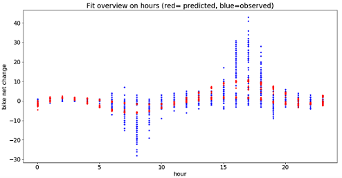

### BeachBoys BikeShare predictive ML preliminary report

### author: Nathanael Larigaldie

BeachBoy BikeShare, a bike share service provider located in San Francisco Bay Area, has asked us to explore the possibility of a machine learning algorithm to predict the net rate of bike renting at any hour for any of their 70 stations around the Area. If succesful, this should allow them to plan in advance when and where to move bikes between stations to ensure a constant availability to users who want to get a bike at a given station, and an empty dock availability to users who went to give one back.

The report will first include a brief exploration of the data with relevant remarks that could be of interest for both the company and the modeling approaches. Note that since there already was a clear description of the original datasets in the project assignment, it won't be repeated here.

The report will then briefly describe the two predictive models that we explored (and  propose for a future development), along with their prediction results and discussion about possible improvements.

Finally, there will be a conclusion summarizing general observations and recommendations about the future project.

NB: Please note that the report focuses only on important points and examples extracted from the data. More information, graphs and examples can be found in the Jupyter Notebook file.

# Data manipulation & exploration

## General remarks

### Trip dataset

The Trip dataset does not have all the columns stated in the project assignment (Start Terminal and Duration are missing). However, Start Terminal seems redundant with Start Station so this one probably is just an error in the documentation. Duration can be recomputed if necessary.

### Weather dataset

The weather dataset includes a lot of variables, and has a lot of cases where at least one value is missing. To avoid losing a lot of datapoints by dropping them all, and for the sake of clarity and parsimony, some variables were excluded. Some of them were strongly correlated from one another, making them somewhat redundant. Others also seemed very unlikely to influence our variable of interest. Therefore we only kept the mean variable when min/mean/max variables were given, and we discarded the Dew point and Direction of the wind.

### Station dataset

It was mentioned in the project assignment that some stations moved during the period covered by the dataset. However, a quick check showed that they were only short-range moves (new stations are still covering the same area than the old ones and just moved a few meters). Therefore, we will consider that trip data about stations before they moved just belong to the latter station. There is no reason to believe predictions should be very different, especially considering that none of them changed the docking count in the process.

## The clean dataset

### Creation

- Because the project specs mentioned hour-level granularity in predictions, we have limited the dataset to hourly cases for now. Hours were rounded down, and cases in the same hour and same station summed. For each station, a trip starting at a particular hour meant decreasing the bike net change by one, and a trip finishing there meant increasing it.

- **The trip dataset was considered complete** in the process, meaning that if at any time and at any station no movement was recorded, the net change was computed as 0 and we do not consider the results as uncertain. This resulted in a dataset with one case for each hour of every day for every station.

- Cases with absent values were only dropped for relevant variables when and if models were using them.

- Variables retained in this final dataset were: year, month, day, hour, station name, city, dock count, Mean TemperatureF, Mean Humidity, Mean VisibilityMiles, Mean Wind SpeedMPH, PrecipitationIn, CloudCover, net change, weekday, datetime

Names are self explanatory and/or taken directly from other datasets at the exception of _weekday_. This is an added variables that is worth 0 when the date is a Saturday of Sunday, and 1 for any other day.

### Data exploration

It would seem that not only San Francisco is the city with the most stations, but it is also the city where the stations are most used, by far. Redwood City have a net change per hour different from 0 only 5% of the time. This does not mean that those stations are only used 5% of the time, as it could be that they received and lost the same amount of bikes for some hours. Nevertheless, since it is probably only marginal it still gives a rough idea.

Across the most used stations, a few observations emerge:

- There are clear patterns of net changes that can be attributed to commuting on the average day. Indeed, bike stations near a train station show negatives peaks around 8am (lots of bikes taken), and positive peaks around 5pm (lots of bikes docked back). Other stations show opposite peaks around the same times. Also, these stations barely record any movement on weekends.

- Consequently, _hour_ and _weekday_ seem to give a lot of information about the bike net change. Other variables only seem marginally interesting.

- It would seem that people use less bikes in December overall (not _just_ at Christmas time). Otherwise the general trend of use seems stable.

- Even among the most used stations, it would seem that extreme net change values (>30 or <-30) within an hour are fairly marginal (they are only present for the top two stations). Apart from these two, this should in general give some time to react to a peak of use on an hourly basis. But this also means that for these two stations, there should sometimes be several transfers available per hour to cope with the affluence of cyclists. This is certainly where accurate predictions would come in handy.

# Modelling

We will try and compare two modelling approaches. We will first review how a Lasso regression approach performs on the data. But as the general aspect of the data would also suggest a time series forecasting approach, we will also try a triple exponential smoothing model (Holt-Winters)

## Model 1 (Lasso Regression)

For this model we will consider that, given enough information, the bike net change at any hour/day is independent from the bike net change at another hour/day. Predicting the bike net change at station 70 at 9am tomorrow, is therefore the same as predicting the net change at that station at 9am another day as long as regressors are equal.

Considering the shape of the relationship between hour and net change, we will include polynomial features but limit ourselves to the 6th degree to avoid overfitting and keep computations manageable. Since our client is interested in predictions for particular stations, we will fit the model to stations one at a time.

We will include _hour_, _weekday_, _Mean_ _TemperatureF_ and _PrecipitationIn_ as regressors. This particular choice is motivated by both computational power (including all variables and their interaction combinations requires a lot of memory), and the fact that those variables seemed to be among the most interesting ones in theory, and according to graphs.

The reason why we chose a Lasso Regression instead of a traditional multiple regression is that we will try models with lots of polynomial and interaction terms, and we want to avoid overfitting. Lasso Regression should only select terms that play a significant role in explaining the variance.

### Results

Results only include the 5 most used stations as a proof of concept. Graphs reported here are only for station 70 and are fairly representative of the 5 stations (please see the Jupyter notebook for more graphs).

| Station | Polynomial Degree | RMSE | R-squared |
|---------|-------------------|------|-----------|
|    70   |                 6 | 4.995|     0.454 |
|    88   |                 6 | 4.642|     0.287 |
|    50   |                 6 | 2.894|     0.343 |
|    61   |                 6 | 2.278|     0.133 |
|    65   |                 6 | 2.404|     0.359 |

Several problems arise here:

- It seems that our model only predicts very low absolute values in their respective ranges. Considering that the whole point of these predictions is to predict when very high (or very low) values may happen to plan accordingly, this makes the model useless for our purpose as it is.

- RMSEs seem a bit high compared to their respective ranges. R-squared values are also pretty low for prediction.

- Residual plots constantly show heteroscedasticity and a pattern similar to the net change vs. hour plots. This can be interpreted as the sign of two (not mutually exclusive) things: we lack some important variable in the model, and there is autocorrelation.

Adding new informative variables could potentially account for more variance, explain the extreme values and mitigate even more the possible autocorrelation. A traffic variable, for instance, could maybe help the model understand why some sudden peaks happen. Manifestation days, public transportation strikes, road closures and other similar factors could also be very useful to include.

## Model 2 (Holt-Winters)

The second model treats the dataset as a time series, and assumes autocorrelation and seasonality. As we want a weekly seasonality but an hourly precision, the seasonality component of the model will be set to 168 (24H\*7). This type of model is unable to take exogeneous variables into account.

### Results

Once again, results only include the 5 most used stations as a proof of concept. Graphs reported here are only for one week at station 70 and are fairly representative of the average week at the top 5 stations.

The model was tried with a single training (and a general forecast starting from the end date of the training set), and with a weekly re-training. Re-training the model gave slightly better results, and RMSEs shown in the table come from this re-training version. It should be possible to automatize a data gathering and model retraining process to ensure getting the best predictions out of the model.

The average RMSE with weekly re-training is consistently lower than for our first model. This shows a clear superiority of this model compared to the last one, especially since this one does not shy away from predicting extreme values when relevant. A quick look at residual plots also shows a much lower heteroscedasticity, along with less and smaller inaccuracies.

| Station | RMSE |
|---------|------|
|    70   | 2.834|
|    88   | 3.126|
|    50   | 2.173|
|    61   | 2.227|
|    65   | 1.842|

Overall, this model seems able to do usable predictions. Prediction graphs show that some inaccuracies are mostly a matter of lag (computing predictions for a couple of hours at a time could mitigate the problem).

Although this model would probably be very useful as is, it suffers from strong limitations:

- As it is, it would be unable to predict the drop in bike usage around Christmas time. More generally, it would only adapt to a local change in trend by first observing it for some time.

- Residual plots still show a bit of heteroscedasticity, and even though large residuals are rare, they still happen and can be problematic.

- Since this model is unable to use any other variable than hour (and week day) into account, only minor tweaks could improve results in a limited way. We would require to use another type of model to be able to take exogeneous variables into account.

# Conclusions

This concludes our preliminary exploration of predictive algorithms for this bike share service provider. We did manage to design a model capable of an acceptable accuracy, although it will not be easy to improve it without changing the modelling approach altogether.

A SARIMAX model could be explored as a follow-up to the Holt-Winters model, but it would probably require variables more closely related to the net change than those we have used here to produce something really accurate. As was mentionned in the Lasso regression model, traffic data would be an interesting candidate. The amount of bikes currently in use in the whole network could also be interesting to include. In any case, if we do add more variables, the Lasso regression could also be tried again.

It could be beneficial to consider opening more bike stations around the train station, or expanding the ones already there, if that is possible. Indeed, it would seem that a high number of fast and reactive transfers are necessary nearly every working day, which must represent a significant cost.

# Appendix

Documents included: 

- Report.md: This file

- BeachBoy BikeShare.ipynb: Jupyter notebook with all the code used for the report, along with more graphs, info and exploration

- data/station_data.csv, data/trip_data.csv, data/weather_data.csv: original data files

- hours_model_1.png, hours_model_2.png, resid_model_1.png, resid_model_2.png: graphs used in this report
